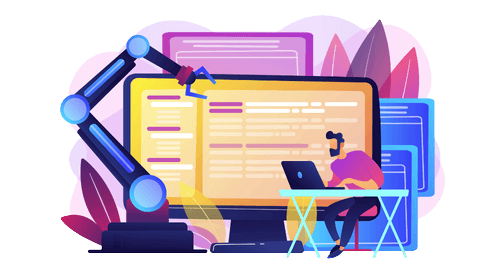

# MasterClass

<div align="center">
    
</div>

Durante o evento que terá duração de três dias, criaremos uma aplicação simples para simular uma agência de viagens. O objetivo é criar um monólito e migrar para micro serviços, utilizando das melhores práticas.


<div align="center">
    
</div>

## Conteúdo
Neste masterclass veremos

- Construir aplicações evolutivas sem ser refém das "modinhas"
- "Quebrar" um monólito em serviços menores sem quebrar a cabeça
- Fazer seus deploys em produção sem perder noites de sono
- Saber quando a arquitetura de microservices deve ser utilizada ou não

## Tecnologias

Utilizaremos o framework Quarkus juntamente com algumas extensões para desenvolver os serviços. O projeto foi gerado a partir do [Quarkus.io](https://code.quarkus.io/)

- Quarkus 2.16.2 Final
- Java 17
- Maven

*extensões maven*

- RESTEasy Classic
- RESTEasy Classic JSON-B
- REST Client Classic
- REST Client Classic JSON-B
- Hibernate ORM with Panache
- JDBC Driver - H2

## Iniciando projeto

Para startar um projeto basta rodar o seguinte comando na raiz do projeto. 

```sh
mvn quarkus:dev
```
Observação, se atente a porta que o projeto está rodando pra não subir um serviço em uma porta já utilizada. Para configurar a porta navegue até o arquivo `src > main > resources > application.properties`

verifique a propriedade

```java
//exemplo
quarkus.http.port=8080
```

## Como testar uma chamada

Utilizamos o terminal e o comando `curl` para simular a aplicação que irá consumir as API's. 

```sh
# exemplo como chamar o serviço que lista os clientes
curl localhost:8080/client
```